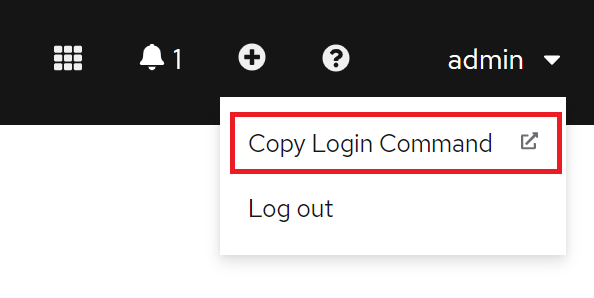

# Ansible Operator 练习 1

在本练习中，您将完成以下内容：

- 在 Ansible 中创建 Operator 脚手架
- 向Operator Ansible 角色添加简单的调试打印语句
- 更新Operator自定义资源 (CR) 并添加参数以切换打印语句
- 使用 ansible-runner 测试operator

## 第 1 步：打开您的 OpenShift Web 控制台并复制登录命令

- 选择`Copy Login Command`



按`Display Token`


- 复制`Log in with this token`


- 插入您的终端会话

`oc login --token=7DMj4CRxuUCzXXXXXXXXXX --server=https://XXXXX.com:30596`

- 验证您的登录

示例输出：


### 第 2 步：创建一个新的 OpenShift 项目

`oc new-project operator-helloworld`

示例输出：

```shell
Now using project "operator-helloworld" on server "https://api.cluster-lbcac3.lbcac3.sandbox502.opentlc.com:6443".

You can add applications to this project with the 'new-app' command. For example, try:

oc new-app rails-postgresql-example

to build a new example application in Ruby. Or use kubectl to deploy a simple Kubernetes application:

kubectl create deployment hello-node --image=k8s.gcr.io/serve_hostname
```

### 第 3 步：创建Operator脚手架

使用 operator-sdk，为您的新Operator创建脚手架。

operator-sdk 将生成一个 Ansible `role`，创建一个新的和安装Operator`custom resource definition (CRD)`所需的一切。`k8s objects`这是一个两步过程。首先初始化然后创建API。

```shell
mkdir operator-helloworld
cd operator-helloworld
operator-sdk init --plugins=ansible --domain=hello.example.com
```

下图显示了创建的文件夹和文件。


创建API

```shell
operator-sdk create api --group cache --version v1 --kind Hello --generate-role
```

### 第 4 步：创建[自定义资源定义 (CRD)](https://docs.openshift.com/container-platform/4.5/rest_api/extension_apis/customresourcedefinition-apiextensions-k8s-io-v1.html)

这`operator-sdk`将生成一个自定义资源定义 (CRD)。

> 自定义资源定义 (CRD) 将`extend`k8s API 并允许用户`interact`通过 API 使用 Operator。

在这里，我们将在当前项目中安装自定义资源定义（CRD）`operator-helloworld`。

```
make install
```

示例输出：


*注意：* 要检查 期间发生的情况`install`，只需打开`Makefile`.

```
vi Makefile
```

示例输出：

```shell
#_ VERSION defines the project version for the bundle.
# Update this value when you upgrade the version of your project.
# To re-generate a bundle for another specific version without changing the standard setup, you can:
# - use the VERSION as arg of the bundle target (e.g make bundle VERSION=0.0.2)
# - use environment variables to overwrite this value (e.g export VERSION=0.0.2)
VERSION ?= 0.0.1

# CHANNELS define the bundle channels used in the bundle.
# Add a new line here if you would like to change its default config. (E.g CHANNELS = "candidate,fast,stable")
# To re-generate a bundle for other specific channels without changing the standard setup, you can:
# - use the CHANNELS as arg of the bundle target (e.g make bundle CHANNELS=candidate,fast,stable)
# - use environment variables to overwrite this value (e.g export CHANNELS="candidate,fast,stable")
ifneq ($(origin CHANNELS), undefined)
BUNDLE_CHANNELS := --channels=$(CHANNELS)
endif

# DEFAULT_CHANNEL defines the default channel used in the bundle.
# Add a new line here if you would like to change its default config. (E.g DEFAULT_CHANNEL = "stable")
# To re-generate a bundle for any other default channel without changing the default setup, you can:
# - use the DEFAULT_CHANNEL as arg of the bundle target (e.g make bundle DEFAULT_CHANNEL=stable)
# - use environment variables to overwrite this value (e.g export DEFAULT_CHANNEL="stable")
ifneq ($(origin DEFAULT_CHANNEL), undefined)
BUNDLE_DEFAULT_CHANNEL := --default-channel=$(DEFAULT_CHANNEL)
endif
BUNDLE_METADATA_OPTS ?= $(BUNDLE_CHANNELS) $(BUNDLE_DEFAULT_CHANNEL)
…………
```

### 可选步骤 4.1：检查`Custom Resource Definition (CRD)`集群中创建的

- 打开 OpenShift Web 控制台并选择`Administration -> Custom Resource Definitions`并插入`hello`搜索字段。


- 按`Hello`，您会看到自定义资源定义的详细信息。


### 步骤 5：将打印任务添加到Operator角色

Operator框架实现 Ansible 角色。默认情况下，它将创建一个角色，但您当然可以拥有多个角色。角色映射到`watches.yaml`文件中 CRD 的 API 端点。在这种情况下，我们将添加一个打印语句，该语句将在角色的参数 toggle_message 设置为 true 时打印一些调试。

- 打开`./watches.yaml`文件并检查内容。

```shell
vi watches.yaml

---
# Use the 'create api' subcommand to add watches to this file.
- version: v1
  group: cache.hello.example.com
  kind: Hello
  role: hello
#+kubebuilder:scaffold:watch
```

- 打开`./roles/hello/tasks/main.yml`文件并插入打印语句。

```shell
vi roles/hello/tasks/main.yml
```

要添加到 `main.yml` 的内容

```shell
---
# tasks file for hello
- name: Hello World Task
  debug:
    msg: "Hello World! I live in a namespace called {{ ansible_operator_meta.namespace }}"
  when: toggle_message
```

### 第 6 步：将参数添加到 Operator 自定义资源

在这里，我们将`toggle_message`参数添加到 CR。CR 规范下的任何参数都在 Ansible 中自动可见。

这就是您从用户那里获得输入的方式。此外，您可能已经注意到，您可以使用`ansible_operator_meta`ansible 中的参数访问 CR 元数据。在上面的示例中，这是名称空间的名称。

```shell
vi config/samples/cache_v1_hello.yaml
```

要添加到`cache_v1_hello.yaml`文件的内容。`# TODO(user): Add fields here`将替换为`toggle_message: true`.

```yaml
apiVersion: cache.hello.example.com/v1
kind: Hello
metadata:
  name: hello-sample
spec:
  toggle_message: true
```

### 第 7 步：使用 ansible-runner 运行 Operator

现在我们已经实现了一些任务和我们的参数，我们可以在本地运行 Operator`ansible-runner`来测试它。

```shell
ansible-operator run local
```

示例输出：

```
# ansible-operator run local
{"level":"info","ts":1663485685.2680025,"logger":"cmd","msg":"Version","Go Version":"go1.18.5","GOOS":"linux","GOARCH":"amd64","ansible-operator":"v1.23.0","commit":"1eaeb5adb56be05fe8cc6dd70517e441696846a4"}
{"level":"info","ts":1663485685.2706983,"logger":"cmd","msg":"Watch namespaces not configured by environment variable WATCH_NAMESPACE or file. Watching all namespaces.","Namespace":""}
I0918 07:21:26.321115    2747 request.go:601] Waited for 1.024168954s due to client-side throttling, not priority and fairness, request: GET:https://api.cluster-lbcac3.lbcac3.sandbox502.opentlc.com:6443/apis/operator.openshift.io/v1?timeout=32s
{"level":"info","ts":1663485687.7286577,"logger":"controller-runtime.metrics","msg":"Metrics server is starting to listen","addr":":8080"}
{"level":"info","ts":1663485687.7330806,"logger":"watches","msg":"Environment variable not set; using default value","envVar":"ANSIBLE_VERBOSITY_HELLO_CACHE_HELLO_EXAMPLE_COM","default":2}
{"level":"info","ts":1663485687.7331684,"logger":"cmd","msg":"Environment variable not set; using default value","Namespace":"","envVar":"ANSIBLE_DEBUG_LOGS","ANSIBLE_DEBUG_LOGS":false}
{"level":"info","ts":1663485687.7331893,"logger":"ansible-controller","msg":"Watching resource","Options.Group":"cache.hello.example.com","Options.Version":"v1","Options.Kind":"Hello"}
{"level":"info","ts":1663485687.7368166,"logger":"apiserver","msg":"Starting to serve metrics listener","Address":"localhost:5050"}
{"level":"info","ts":1663485687.7368162,"logger":"proxy","msg":"Starting to serve","Address":"127.0.0.1:8888"}
```

### 第 8 步：创建一个 hello 自定义资源

打开另一个终端并在您的 OpenShift 集群中创建 CR。创建 CR 后，Operator 将执行 Ansible 角色任务并打印我们的调试消息。

```shell
oc create -f config/samples/cache_v1_hello.yaml
```

示例输出第二个终端：

```shell
hello.cache.hello.example.com/hello-sample created
```

示例输出第一个终端：

```shell
 TASK [Hello World Task] ********************************
ok: [localhost] => {
    "msg": "Hello World! I live in a namespace called operator-helloworld"
}
```


