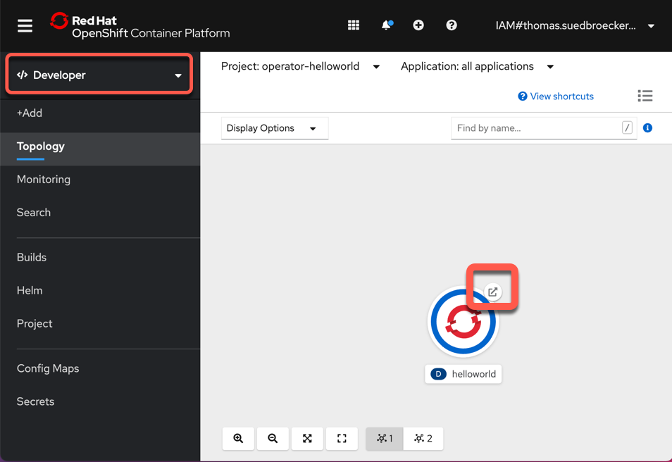
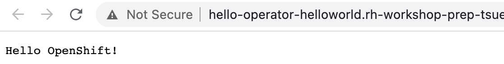

# Ansible Operator 练习 2

在本练习中，您将完成以下内容：

- 扩展[Ansible role](https://docs.ansible.com/ansible/latest/user_guide/playbooks_reuse_roles.html)以获取集群域名并将其保存在事实中
- 扩展[Ansible role](https://docs.ansible.com/ansible/latest/user_guide/playbooks_reuse_roles.html)以部署 helloworld 应用程序
- 使用 [ansible-runner](https://github.com/ansible/ansible-runner)测试operator
- 将 operator 部署到命名空间，使其在没有[ansible-runner](https://github.com/ansible/ansible-runner)的情况下运行

### 第 1 步：更新 Ansible 角色以获取集群域名并保存为事实

在这里，我们将学习使用该`k8s Ansible`模块来收集我们以后要在自动化中使用的信息。本例为集群域名。将以下任务附加到 Ansible role。

我们将使用以下[Asible](https://docs.ansible.com/)关键字：

- [k8s_info](https://docs.ansible.com/ansible/latest/collections/community/kubernetes/k8s_info_module.html)
- [set_fact](https://docs.ansible.com/ansible/latest/collections/ansible/builtin/set_fact_module.html)
- debug

`vi roles/hello/tasks/main.yml`

要添加进来的内容`main.yml`：

```
- name: Get Application Domain from Cluster Ingress
  k8s_info:
    api_version: config.openshift.io/v1
    kind: Ingress
    name: cluster
  when: application_domain is undefined
  register: ingress

- name: Set Application Domain
  set_fact:
    application_domain: "{{ ingress.resources[0].spec.domain }}"
  when: application_domain is undefined

- name: Print application domain
  debug:
    msg: "Application domain is {{ application_domain }}"
```

### 第 2 步：使用 ansible-runner 运行 Operator

每次启动 Operator 或我们的 CRD 发生某些更改时，Ansible 角色都会运行，并且我们的更改当然会被执行。

```shell
ansible-operator run local
```

在示例输出中，您可以看到`main.yml`.

- `Gathering Facts`

```shell
--------------------------- Ansible Task StdOut -------------------------------
TASK [Gathering Facts] *********************************************************
-------------------------------------------------------------------------------
{"level":"info","ts":1612430621.8876169,"logger":"logging_event_handler","msg":"[playbook debug]","name":"hello-sample","namespace":"operator-helloworld","gvk":"cache.hello.example.com/v1, Kind=Hello","event_type":"runner_on_ok","job":"3916589616287113937","EventData.TaskArgs":""}
```

- `Hello World Task`

```
--------------------------- Ansible Task StdOut -------------------------------
TASK [Hello World Task] ******************************** 
ok: [localhost] => {
    "msg": "Hello World! I live in a namespace called operator-helloworld"
}
"level":"info","ts":1612430621.8958986,"logger":"logging_event_handler","msg":"[playbook task]","name":"hello-sample","namespace":"operator-helloworld","gvk":"cache.hello.example.com/v1, Kind=Hello","event_type":"playbook_on_task_start","job":"3916589616287113937","EventData.Name":"hello : Get Application Domain from Cluster Ingress"}
```

- `hello : Get Application Domain from Cluster Ingress`

```shell
-------------------------- Ansible Task StdOut -------------------------------
TASK [hello : Get Application Domain from Cluster Ingress] *********************
task path: /home/ubuntu/operator-helloworld/roles/hello/tasks/main.yml:8
"level":"info","ts":1612430622.4394364,"logger":"proxy","msg":"Skipping cache lookup","resource":{"IsResourceRequest":false,"Path":"/version","Verb":"get","APIPrefix":"","APIGroup":"","APIVersion":"","Namespace":"","Resource":"","Subresource":"","Name":"","Parts":null}}
....
```

- `Print application domain`

```
--------------------------- Ansible Task StdOut -------------------------------
TASK [Print application domain] ******************************** 
ok: [localhost] => {
    "msg": "Application domain is rh-workshop-..000.us-south.containers.appdomain.cloud"
}
level":"info","ts":1612430626.1358507,"logger":"runner","msg":"Ansible-runner exited successfully","job":"3916589616287113937","name":"hello-sample","namespace":"operator-helloworld"}
```

- `PLAY RECAP`

```
--------------------------- Ansible Task Status Event StdOut  -----------------
PLAY RECAP *********************************************************************
localhost                  : ok=5    changed=0    unreachable=0    failed=0    skipped=0    rescued=0    ignored=0   
```

### 第 3 步：更新 Ansible  role以部署 hellowoworld 应用程序

现在我们将学习使用`k8s`Ansible 模块来部署应用程序。我们将部署一个应用打印信息到`STDOUT`. 请注意，该路由使用的是我们在上一步中收集的集群域。在这一步中，我们将为我们的 helloworld 应用程序创建部署、服务和路由。将以下任务附加到 Ansible 角色。

```shell
vi roles/hello/tasks/main.yml
```

- 我们`k8s:definition:`用来定义`Service`,`Deployment`和`Route`

```
- name: Deploy helloworld service
  k8s:
    definition:
      apiVersion: v1
      kind: Service
      metadata:
        namespace: "{{ ansible_operator_meta.namespace }}"
        labels:
          app: helloworld
        name: helloworld
      spec:
        ports:
        - port: 8080
          targetPort: 8080
        selector:
          app: helloworld
          name: helloworld
      status:
        loadBalancer: {}

- name: Deploy helloworld app
  k8s:
    definition:
      kind: Deployment
      apiVersion: apps/v1
      metadata:
        name: helloworld
        namespace: "{{ ansible_operator_meta.namespace }}"
        labels:
          app: helloworld
      spec:
        replicas: 1
        strategy:
          type: RollingUpdate
        selector:
          matchLabels:
            app: helloworld
        template:
          metadata:
            labels:
              app: helloworld
              name: helloworld
          spec:
            containers:
            - image: openshift/hello-openshift
              imagePullPolicy: Always
              name: helloworld
              readinessProbe:
                httpGet:
                  path: /
                  port: 8080
                initialDelaySeconds: 60
                periodSeconds: 10
                timeoutSeconds: 60
              livenessProbe:
                httpGet:
                  path: /
                  port: 8080
                initialDelaySeconds: 120
                periodSeconds: 10
              ports:
              - containerPort: 8080
            restartPolicy: Always
        triggers:
        - type: ConfigChange

- name: Deploy helloworld route
  k8s:
    definition:
      apiVersion: route.openshift.io/v1
      kind: Route
      metadata:
        namespace: "{{ ansible_operator_meta.namespace }}"
        annotations:
          openshift.io/host.generated: "true"
        name: helloworld
      spec:
        host: "hello-{{ ansible_operator_meta.namespace }}.{{application_domain}}"
        to:
          kind: Service
          name: helloworld
          weight: 100
        port:
          targetPort: 8080
        wildcardPolicy: None
```

### 步骤 4：更新角色权限

由于我们正在创建一个`service`并且`route`我们需要将这些权限添加到`hello` role 中，以添加服务以便我们可以创建它们。

打开`role.yaml`文件。（有关[role](https://docs.ansible.com/ansible/latest/user_guide/playbooks_reuse_roles.html)的更多信息）

```shell
vi config/rbac/role.yaml
```

更改权限。

```shell
##
## Rules for cache.hello.example.com/v1, Kind: Hello
##
  - apiGroups:
      - ""
    resources:
      - secrets
      - pods
      - pods/exec
      - pods/log
      - services
    verbs:
      - create
      - delete
      - get
      - list
      - patch
      - update
      - watch
```

还附加`routes`和`ingress api`组，以便我们也可以管理这些对象。

```shell
##
## Rules for cache.hello.example.com/v1, Kind: Hello
##
  ...
  ...
  - apiGroups:
    - ""
    - config.openshift.io
    resources:
    - ingresses
    verbs:
    - create
    - delete
    - deletecollection
    - get
    - list
    - patch
    - update
    - watch
  - apiGroups:
    - ""
    - route.openshift.io
    resources:
    - routes
    - routes/custom-host
    verbs:
    - create
    - delete
    - deletecollection
    - get
    - list
    - patch
    - update
    - watch
```

### 第 5 步：使用 ansible-runner 运行 Operator

这次我们应该看到正在部署的应用程序。应该启动一个 pod 并创建一个`service/route`。

```shell
ansible-operator run local
```

### 第 6 步：测试我们的部署

要测试，只需对路由 URL 使用 curl。启动应用程序大约需要一分钟左右。

- pods：

```shell
oc get pods
```

示例输出：

```shell
NAME                         READY   STATUS    RESTARTS   AGE
helloworld-f9d964dcc-jgcmn   1/1     Running   0          70s
```

* routes：

```
oc get routes
```

示例输出：

```shell
NAME         HOST/PORT                                             PATH   SERVICES     PORT   TERMINATION   WILDCARD
helloworld   hello-operator-helloworld.apps.xxxxx.com          helloworld   8080
```

- 使用 curl调用`YOUR`URL 或仅打开浏览器并插入 URL

```shell
$ curl http://hello-operator-helloworld.xxxxxx.com
Hello OpenShift!
```

### 可选步骤 7：在您的 RedHat Web 控制台中打开[Developer 视图](https://docs.openshift.com/container-platform/4.5/web_console/odc-about-developer-perspective.html)

- 选择`operator-helloworld`项目
- `external route`从`helloworld`pod中选择



在浏览器中验证应用程序


