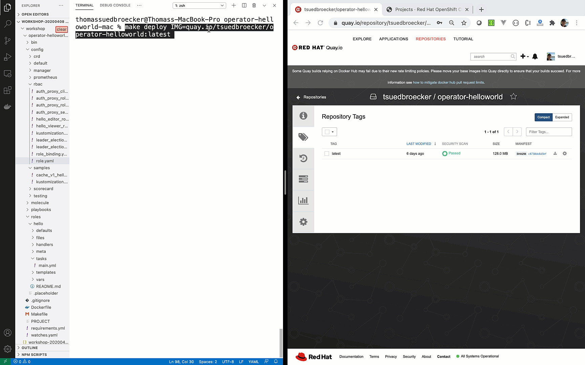
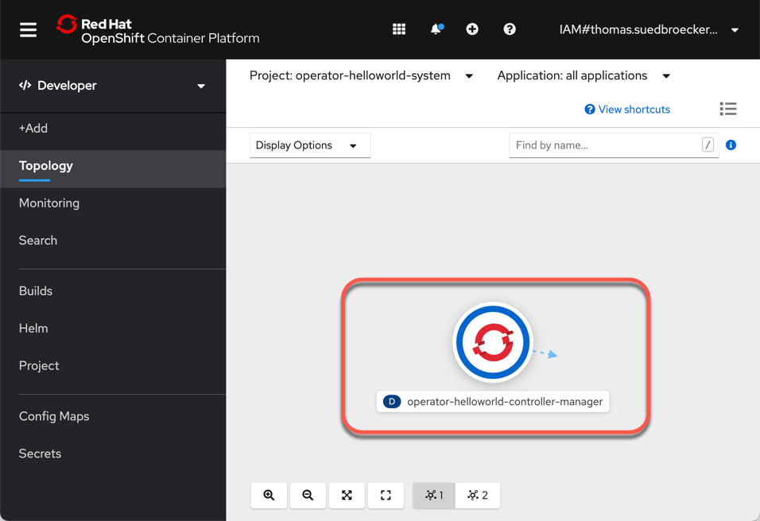

# Ansible Operator 练习 3

在本练习中，您将完成以下内容：

- 创建一个[Quay.io](https://quay.io/)帐户
- 构建我们 Operator 的镜像并将其推送到[Quay.io](https://quay.io/)
- 将 Operator 部署到 OpenShift 集群

### 概览

在这里，通过使用[Quay.io](https://quay.io/)容器镜像仓库中的现有容器镜像，您可以看到我们将在本练习中创建的`HelloWorld operator`示例部署。然后我们使用 RedHat OpenShift 集群中的operator创建一个新`HellowWorld`应用程序：

- 部署operator：



- 使用operator创建 HelloWorld 应用程序：


### 第一步：创建 Quay.io 账户

Quay.io 是 Red Hat 提供的容器镜像仓库。您可以创建自己的帐户向其推送容器镜像。每个镜像可以是公共的或私有的。要使 OpenShift 可以使用镜像，您需要将它们公开。

如果您没有帐户，请访问[Quay.io](https://quay.io/)创建您自己的帐户，然后登录[Quay.io](https://quay.io/)。

创建公共开放的Repository，例如名为operator-helloworld。


在右上角的Account Setting菜单打开账户设置页面，然后点击生成加密口令，输入密码后再点击Verify。


在打开的对话框中选择“Docker Login”菜单，复制包含加密口令的Docker Login命令。


执行此命令，例如：

```shell
sudo docker login -u="xxxxx" -p="N1Kq0xR60e49wzg/TXJpLdwjng+EMC0qh56RY/0Jj27McW0ZESK5wYvEGkcL7aki" quay.io

Emulate Docker CLI using podman. Create /etc/containers/nodocker to quiet msg.
Login Succeeded!
```

### 第二步：构建 Operator 镜像并推送到 quay.io

*注意:* 以下命令中镜像路径里面的**xxxxx**都您在quay当中的Organization名。

```shell
sudo make docker-build docker-push IMG=quay.io/xxxxx/operator-helloworld:latest
```

检查`operator-helloworld`您的 quay.io 帐户中的镜像设为公开。登录quya.io，点击图片。在“设置”（左下方），可以选择公开镜像。


### 第三步：将 Operator 部署到 OpenShift 集群

修改 `config/default/manager_auth_proxy_patch.yaml`文件，解决镜像的UID必须为固定65532的问题。增加 `runAsUser: 65532`配置。

```
vi config/default/manager_auth_proxy_patch.yaml


spec:
  template:
    spec:
      containers:
      - name: kube-rbac-proxy
        securityContext:
          allowPrivilegeEscalation: false
          capabilities:
            drop:
              - "ALL"
          runAsUser: 65532
```

默认情况下，operator将部署到名为`operator-helloworld-system`的命名空间。 operator名为`operator-helloworld-controller-manager`。

```
make deploy IMG=quay.io/xxxxx/operator-helloworld:latest
```

正如您在示例输出中看到的，我们创建或配置...

- ...命名空间
- ... 自定义资源
- ...[Leader election role](https://docs.openshift.com/container-platform/4.5/operators/operator_sdk/osdk-leader-election.html)
- ... Manager role
- ... Proxy role
- ... Metrixs reader
- ...[Leader election role](https://docs.openshift.com/container-platform/4.5/operators/operator_sdk/osdk-leader-election.html) binding
- ...Manager role binding
- ... Proxy role binding
- ...Controller Manager metrics service
- ... Controller Manager

示例输出：

```shell
cd config/manager && /home/ubuntu/operator-helloworld/bin/kustomize edit set image controller=quay.io/ktenzer/operator-helloworld:latest
/home/ubuntu/operator-helloworld/bin/kustomize build config/default | kubectl apply -f -
namespace/operator-helloworld-system created
customresourcedefinition.apiextensions.k8s.io/hellos.cache.hello.example.com created
role.rbac.authorization.k8s.io/operator-helloworld-leader-election-role created
clusterrole.rbac.authorization.k8s.io/operator-helloworld-manager-role created
clusterrole.rbac.authorization.k8s.io/operator-helloworld-metrics-reader created
clusterrole.rbac.authorization.k8s.io/operator-helloworld-proxy-role created
rolebinding.rbac.authorization.k8s.io/operator-helloworld-leader-election-rolebinding created
clusterrolebinding.rbac.authorization.k8s.io/operator-helloworld-manager-rolebinding created
clusterrolebinding.rbac.authorization.k8s.io/operator-helloworld-proxy-rolebinding created
service/operator-helloworld-controller-manager-metrics-service created
deployment.apps/operator-helloworld-controller-manager created
```

*注意* ：您可以通过编辑`config/default/kustomization.yaml`文件来更改`project name`。

```shell
# Adds namespace to all resources.
namespace: operator-helloworld-system
```

- 为命名空间`serviceaccount`赋予SCC权限

```
oc adm policy add-scc-to-user nonroot -z operator-helloworld-controller-manager --as system:admin
```

- 验证 Operator 部署

```
oc get deployment -n operator-helloworld-system
```

示例输出：

```
NAME                            READY   UP-TO-DATE   AVAILABLE   AGE
operator-helloworld-controller-manager   1/1     1            1           37s
```

*可选*：打开您的 RedHat OpenShift Web 控制台，选择`Developer 视图`和`Topology`. 确保您在`operator-helloworld-system`项目中。



### 第四步：使用部署`Helloworld`应用

使用我们刚刚部署到`operator-helloworld-system`项目中的 Operator，我们现在将使用 CR 部署应用程序。

- 使用operator创建应用程序

```
oc create -f config/samples/cache_v1_hello.yaml -n operator-helloworld-system
```

- 从项目中获取部署信息

```
oc get deployment -n operator-helloworld-system
```

示例输出：

```shell
NAME                            READY   UP-TO-DATE   AVAILABLE   AGE
helloworld                      1/1     1            1           12m
operator-helloworld-controller-manager    1/1     1            1           12m
```

*可选：* 打开您的 RedHat OpenShift Web 控制台，选择`Developer perspective`和`Topology`. 确保您在`operator-helloworld-system`项目中。


*可选：* 打开您的 RedHat OpenShift Web 控制台，选择`Administrator 视图` 和`Custom Resource Definition`

- 搜索`Hello`并点击`Hello` CRD


现在你看到两个两个已经创建的`hello-sample` 应用。

- `operator-helloworld`项目中的一个是在本地机器上创建运行的operator
- `operator-helloworld-system`项目中的一个是 `helloworld-controller-manager`在 RedHat OpenShift Cluster创建的


### 第五步：清理应用程序[¶](https://thomassuedbroecker.github.io/operator-helloworld/exercises/03-exercise/#step-5-cleanup-application "永久链接")

删除 CR 将删除由它创建的所有对象，因为这些对象链接到 CR。

```
oc delete hello hello-sample -n operator-helloworld-system
```

示例输出：

`hello.cache.hello.example.com "hello-sample" deleted`

你看到还剩下一个。


### 第六步：验证operator是否仍在`operator-helloworld-system`项目部署中。

```
oc get deployment -n operator-helloworld-system
```

示例输出：

```
NAME                                     READY   UP-TO-DATE   AVAILABLE   AGE
operator-helloworld-controller-manager   1/1     1            1           153m
```

### 第七步：清理operator

这将删除 Operator、CRD 和所有角色。

```
make undeploy
```

示例输出：

```
/home/ubuntu/operator-helloworld/bin/kustomize build config/default | kubectl delete -f -
namespace "operator-helloworld-system" deleted
customresourcedefinition.apiextensions.k8s.io "hellos.cache.hello.example.com" deleted
role.rbac.authorization.k8s.io "operator-helloworld-leader-election-role" deleted
clusterrole.rbac.authorization.k8s.io "operator-helloworld-manager-role" deleted
clusterrole.rbac.authorization.k8s.io "operator-helloworld-metrics-reader" deleted
clusterrole.rbac.authorization.k8s.io "operator-helloworld-proxy-role" deleted
rolebinding.rbac.authorization.k8s.io "operator-helloworld-leader-election-rolebinding" deleted
clusterrolebinding.rbac.authorization.k8s.io "operator-helloworld-manager-rolebinding" deleted
clusterrolebinding.rbac.authorization.k8s.io "operator-helloworld-proxy-rolebinding" deleted
service "operator-helloworld-controller-manager-metrics-service" deleted
deployment.apps "operator-helloworld-controller-manager" deleted
```

### 第 8 步：验证operator是否已删除

```
oc get deployment -n operator-helloworld-system
```

示例输出：

```
No resources found in operator-helloworld-system namespace.
```

您还可以在 Web 控制台中找找名为`hello`的`Customer Resource Definition` 。


**恭喜**，如果做到这一步，说明您基本了解如何用 Ansible 编写自己的operator了！
